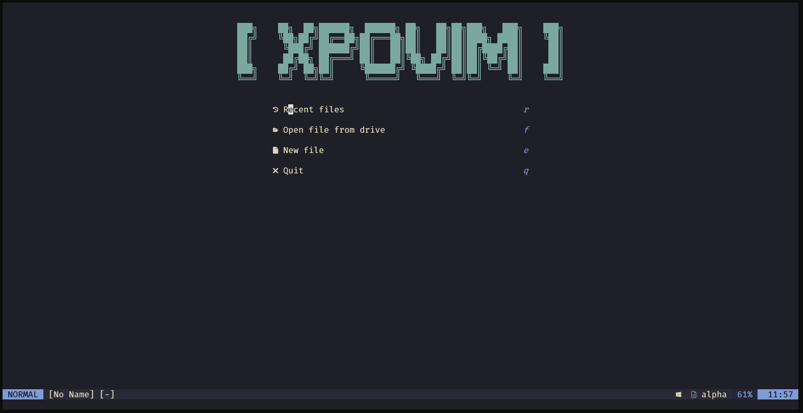

# XPOVIM



<p align="center">
  <a href="https://neovim.io/"></a>
  <a href="https://opensource.org/licenses/MIT"></a>
  <a href="https://github.com/XpolioN2005/XPOVIM"></a>
  <br>
  <a href="https://github.com/XpolioN2005/XPOVIM/stargazers"></a>
  <a href="https://github.com/XpolioN2005/XPOVIM/network/members"></a>
  
</p>

**XPOVIM** is a modern, fast, and highly customizable Neovim configuration for developers, combining an aesthetic UI, powerful navigation, and drive-based file browsing.

---

## Features

- **Modern dashboard** via [alpha-nvim](https://github.com/goolord/alpha-nvim)
- **Drive selection popup** integrated with [Telescope](https://github.com/nvim-telescope/telescope.nvim)
- **Fuzzy file search**: find files, buffers, and live grep
- **Syntax highlighting & smart indentation** via [Treesitter](https://github.com/nvim-treesitter/nvim-treesitter)
- **File explorer** with icons and git highlights via [Nvim-tree](https://github.com/nvim-tree/nvim-tree.lua)
- **Customizable statusline** with [Lualine](https://github.com/nvim-lualine/lualine.nvim)
- **Indent guides** via [indent-blankline.nvim](https://github.com/lukas-reineke/indent-blankline.nvim)
- **Kanagawa colorscheme** for focus and readability

---

## Installation

1. Ensure **Neovim ≥ 0.8** is installed.
2. Clone the repo:

```bash
git clone https://github.com/XpolioN2005/xpoVim.git ~/.config/nvim
```

3. Open Neovim:

```bash
nvim
```

Lazy.nvim will automatically install all required plugins.

---

## Keybindings

| Keys      | Action               |
| --------- | -------------------- |
| `<Space>` | Leader key           |
| `<C-f>`   | Telescope find files |
| `<C-b>`   | Telescope buffers    |
| `<C-g>`   | Telescope live grep  |
| `<C-n>`   | Toggle Nvim-tree     |

### Dashboard Buttons

| Key | Action               |
| --- | -------------------- |
| r   | Recent files         |
| f   | Open file from drive |
| e   | New file             |
| q   | Quit Neovim          |

---

## Drive Popup

- Press `f` in the dashboard to open a floating drive selection.
- Select a drive using number keys or `Enter`.
- Close the popup with `Esc`.

---

## Customization

- Edit `~/.config/nvim/lua/config/drive.lua` to modify available drives.
- Edit `~/.config/nvim/init.lua` to change plugin settings, keybindings, and colorscheme.

---

## License

XPOVIM is released under the MIT License.
